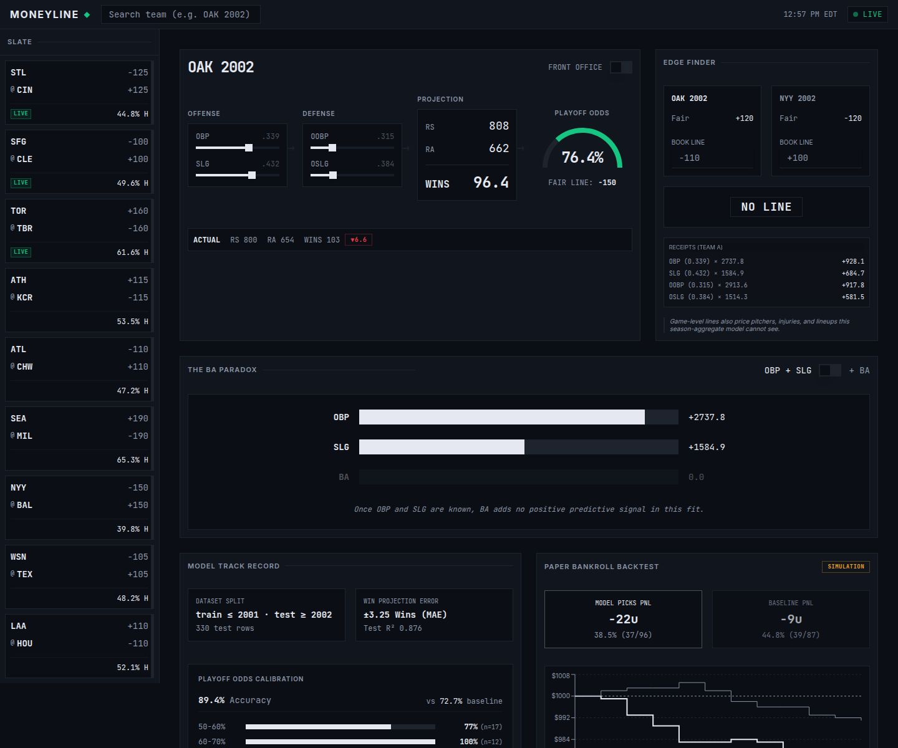

# Moneyline

A baseball analytics desk built on the Moneyball run models.

It refits the classic OBP/SLG run regressions on 1962-2001 MLB data, turns them into fair moneylines for live games using the MLB Stats API, and grades every pick it makes so the track record can be checked. When a sample is too thin to support a number, it says so instead of guessing.



## What's in here

- `backend/`: FastAPI service. Model loading, MLB Stats API feeds with caching, pricing math (Pythagorean expectation, log5, de-vig, half-Kelly), a seeded Monte Carlo rest-of-season sim, and a Postgres record store that grades picks.
- `artifacts/moneyline/`: React + Vite frontend.
- `smoke_test.py` and `verified_stats.json`: regression tests against hand-checked numbers, including the 2002 A's run chain.

## Run it

```sh
pip install -r requirements.txt
pnpm install

export DATABASE_URL=postgres://...
python -m uvicorn backend.main:app          # API
pnpm --filter @workspace/moneyline run dev  # frontend

python smoke_test.py                        # tests
```

## Status

Finished and no longer maintained. Started as my Inspirit AI project. Picks and parlays are paper only.
